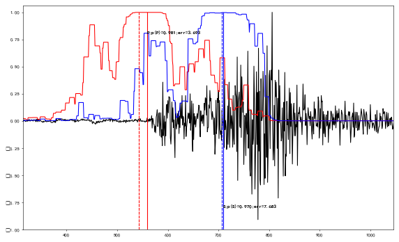

# 机器学习在地震学中的相关研究 
## 引言
> 用于地震学多个方面的深度学习模型

项目包含了多个基本模型，包括用于震相拾取的纯CNN的Inception、WaveNet、UNet和融合的双向RNN结构。以及用于去噪、缺失值填补的对抗生成网络结构。并添加了一些地震学反演的编码解码模型。
模型粗略统计如下：

|名称|用途|推断时间|下载|
|---|----|-----|-----|
|Inception|震相拾取|0.025|[url](LOGS)|
|CNN+BRNN|震相拾取|1.0|[url](LOGS)|
|WaveNet|震相拾取|0.17|[url](LOGS)|
|UNet|震相拾取|0.10|[url](LOGS)|
|GAN|去噪|基于长度|[url](LOGS)|
|Seq2seq|反演|<2s|[url](LOGS)|


仓库主要文件为
1. [Training code](train.py) 用于训练模型的程序；
2. [Testing code](test.py) 用于推断的程序；
3. [utils](utils.py) 用于震相读取和处理的程序。 


## 说明文件目录 

- [机器学习在地震学中的相关研究](#%e6%9c%ba%e5%99%a8%e5%ad%a6%e4%b9%a0%e5%9c%a8%e5%9c%b0%e9%9c%87%e5%ad%a6%e4%b8%ad%e7%9a%84%e7%9b%b8%e5%85%b3%e7%a0%94%e7%a9%b6)
  - [引言](#%e5%bc%95%e8%a8%80)
  - [说明文件目录](#%e8%af%b4%e6%98%8e%e6%96%87%e4%bb%b6%e7%9b%ae%e5%bd%95)
  - [波形拾取任务](#%e6%b3%a2%e5%bd%a2%e6%8b%be%e5%8f%96%e4%bb%bb%e5%8a%a1)
    - [具体使用](#%e5%85%b7%e4%bd%93%e4%bd%bf%e7%94%a8)
    - [推断](#%e6%8e%a8%e6%96%ad)
    - [推断结果](#%e6%8e%a8%e6%96%ad%e7%bb%93%e6%9e%9c)
  - [utils.py文件说明](#utilspy%e6%96%87%e4%bb%b6%e8%af%b4%e6%98%8e)
  - [环境](#%e7%8e%af%e5%a2%83)
  - [维护](#%e7%bb%b4%e6%8a%a4)
  - [文章引用](#%e6%96%87%e7%ab%a0%e5%bc%95%e7%94%a8)

## 波形拾取任务
1. 准备好地震目录 
2. 直接运行train.py程序

### 具体使用 
命令行：
```
train.py [-h] 
         [-b, --batchsize BATCHSIZE] 
         [-m, --modelname MODELNAME] 
         [-c, --channel CHANNEL]
         [-n, --nsamples NSAMPLES]
         [-rs, --resample RESAMPLES]
optional arguments:
  -h, --help         帮助信息
  -b                 批尺寸。默认32。
  -m                 模型名称。"wavenet", "brnn", "inception", "unet"可选，默认inception。
  -n                 采样点数量。默认30000。
  -c                 地震波通道数。默认3。
  -rs                冲采样比例。默认10 
``` 
### 推断 
1. 准备好三分量的npz文件 
2. 运行infer.py文件
命令行：
```
infer.py [-h] 
         [-m, --modelname MODELNAME] 
         [-c, --channel CHANNEL]
         [-rs, --resample RESAMPLES]
         [-i, --input FILE]
         [-o, --output FILE]
optional arguments:
  -h, --help         帮助信息
  -m                 模型名称。"wavenet", "brnn", "inception", "unet"可选，默认inception。
  -c                 地震波通道数。默认3。
  -rs                冲采样比例。默认10。 
  -i, o              输入输出文件。
``` 
### 推断结果


虚线为概率极大值位置，实线为回归修正后结果。

## utils.py文件说明 
其中主类为DataTool() 总共建立三类进程分别为：
- 数据输入进程：batch_data_input, 用于循环的将震相和文件夹输入管道中，供数据处理进程使用。 
- 数据处理进程：process_multitherad*，用于从管道中接收震相文件夹进行读取，并制作标签。每个进程处理一个震相，处理完成后输入管道中。可以有多个进程，默认为10个。
- 数据输出进程：batch_data_output，用于将处理后的数据进行收集，每隔32个数据进行打包输入最终管道。
每类进程是相对独立的，并且不受顺序影响。在进程崩溃后不会尝试重启。 

[未完成]　程序结束后需要手动中断，进程关闭部分未完成。　

## 环境 

程序依赖于[Tensorflow](http://tensorflow.com)的1.x版本。

```sh
$ pip install tensorflow==1.13.1
```

## 维护

[@Cangye](https://github.com/cangyeone).


## 文章引用 
